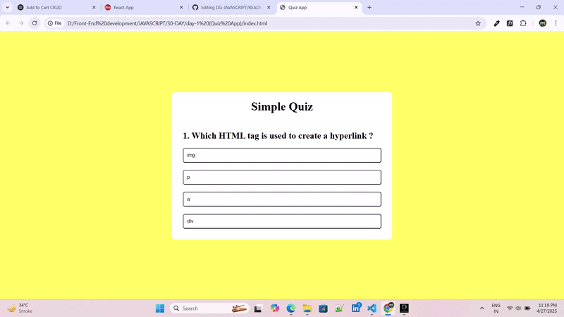
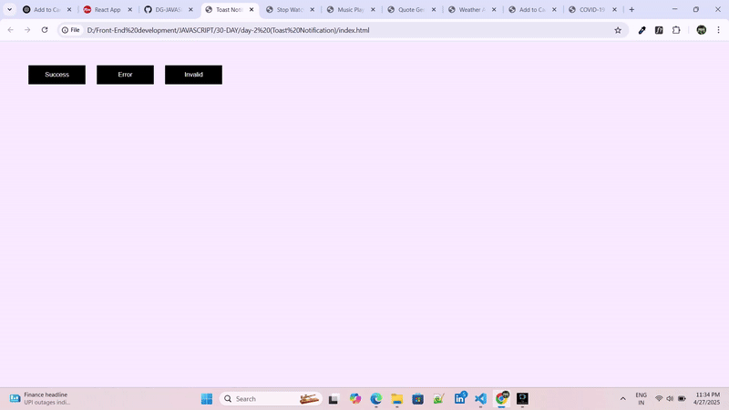
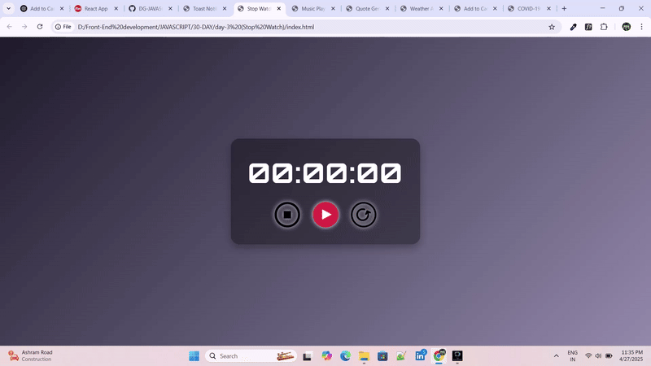
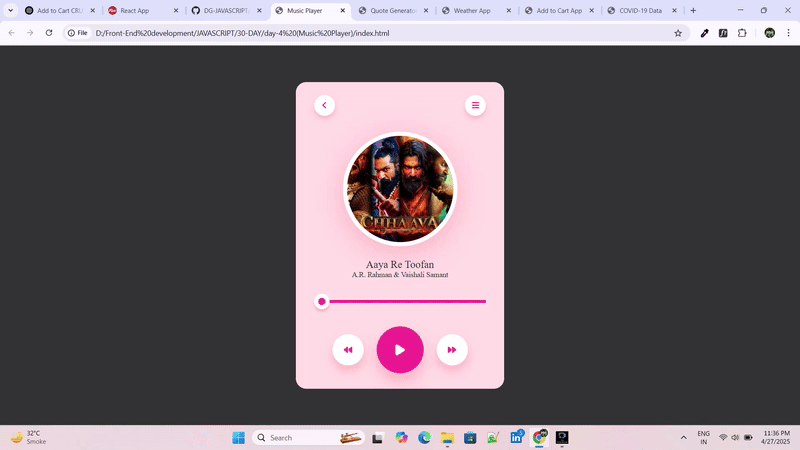
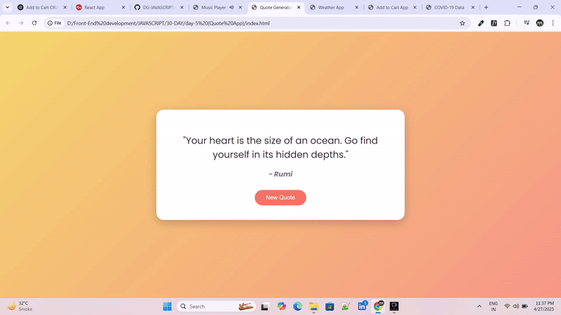
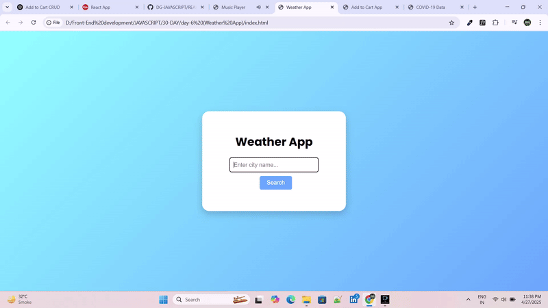
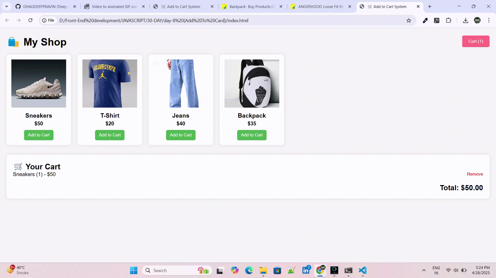
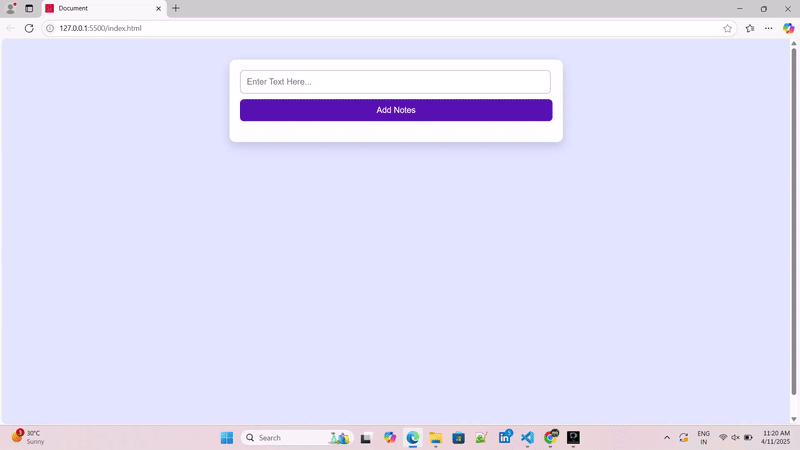
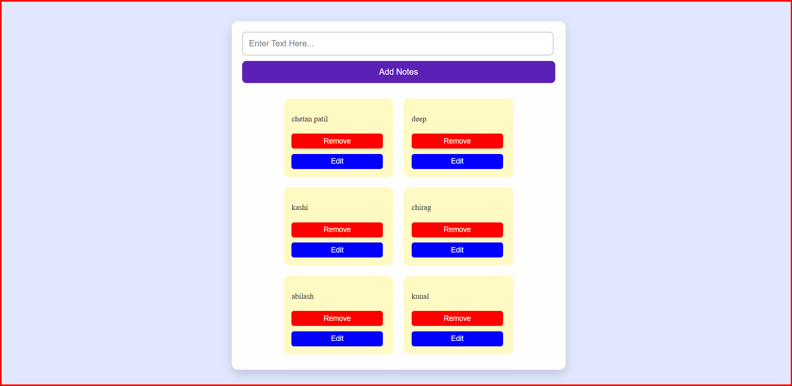

## DAY-1 OUTPUU

🎯 Quiz App
A simple and interactive Quiz Application built with HTML, CSS, and JavaScript.
It allows users to test their knowledge with multiple-choice questions, get instant feedback, and view their final score.

🚀 Features
Dynamic quiz questions with multiple choices

Instant feedback on correct/wrong answers

Score tracking and final result summary

Responsive design (works on mobile and desktop)

Easy to customize with your own questions

🎥 Demo

🛠️ Tech Stack

--> HTML5 — Structure

--> CSS3 — Styling and responsiveness

--> JavaScript — Logic and interactivity

## DAY-2 OUTPUT

🔔 Toast Notification App
A lightweight and customizable Toast Notification system built with HTML, CSS, and JavaScript.
Quickly display brief, auto-dismissable messages to users — perfect for success messages, warnings, errors, or general updates!

🚀 Features
Easy-to-use API for showing notifications

Different types: success ✅, error ❌, warning ⚠️, info ℹ️

Auto-dismiss after a timeout or manual close

Smooth fade-in and fade-out animations

Fully responsive and mobile-friendly

Minimal and customizable styling

🎥 Demo

🛠️ Tech Stack
HTML5 — Structure

CSS3 — Styling and animations

JavaScript (Vanilla) — Functionality and dynamic rendering

## DAY-3 OUTPUT

⏱️ Stopwatch App
A simple and elegant Stopwatch Application built with HTML, CSS, and JavaScript.
Easily start, stop, reset, and track your time with millisecond precision — perfect for quick timing needs or practice sessions!

🚀 Features
Start, Stop, and Reset controls

Live time updates (hours, minutes, seconds, milliseconds)

Clean, responsive UI design

Accurate time tracking using JavaScript timers

Lightweight and easy to customize

🎥 Demo

🛠️ Tech Stack

--> HTML5 — Markup

--> CSS3 — Styling and responsiveness

--> JavaScript — Stopwatch logic and interactivity

## DAY-4 OUTPUT

🎶 Music Player App
A fully functional Music Player built with HTML, CSS, and JavaScript.
This app allows users to play their favorite songs, skip tracks, adjust volume, and view the current track details. A perfect starting point for creating more advanced audio players!

🚀 Features
Play, pause, and skip between tracks

Volume control and mute button

Progress bar to track the current song’s position

Display current song name and artist

Simple and elegant design

Mobile-friendly and responsive

🎥 Demo

🛠️ Tech Stack

--> HTML5 — Structure and content

--> CSS3 — Styling and responsiveness

--> JavaScript — Audio functionality and interactivity

## DAY-5 OUTPUT

📝 Quote App
A simple and elegant Quote App built with HTML, CSS, and JavaScript.
This application displays random inspirational quotes with the click of a button — perfect for motivation, positivity, or just a little daily wisdom!

🚀 Features
Random quote generator on button click

Smooth loading and display animations

Responsive and mobile-friendly design

Easy to customize with your own set of quotes

Option to add author name with each quote

Lightweight and fast — no external libraries required

🎥 Demo

🛠️ Tech Stack

--> HTML5 — Structure

--> CSS3 — Styling and responsiveness

--> JavaScript (Vanilla) — Quote logic and interactivity

## DAY-6 OUTPUT

⛅ Weather City App
A modern and responsive Weather App built with HTML, CSS, JavaScript, and powered by a live Weather API.
Easily search for any city and get real-time weather updates, including temperature, conditions, humidity, and more!

🚀 Features
Search weather by city name

Real-time data fetched from an external Weather API

Display of:

Temperature (°C/°F)

Weather description (cloudy, sunny, rainy, etc.)

Humidity, Wind Speed, and Pressure

Weather icons

Error handling for invalid city names

Responsive and mobile-friendly design

Clean and smooth UI animations

🎥 Demo

🛠️ Tech Stack

--> HTML5 — Structure and form

--> CSS3 — Styling and responsiveness

--> JavaScript (Vanilla) — API handling and interactivity

Weather API — (Example: OpenWeatherMap API)

## DAY-7 OUTPUT

🖼️ Image Search Engine

A sleek and responsive image search engine built with HTML, CSS, and JavaScript, powered by a public image API (e.g., Unsplash API or Pexels API). This project allows users to search for images using keywords and view results in a visually appealing gallery format.

🔍 Features

--> Real-time image search using API

--> Responsive and modern UI design

--> Infinite scroll / Load more functionality

--> Error handling for failed API requests

--> Clean and organized codebase

🚀 Tech Stack

--> Frontend: HTML5, CSS3, JavaScript (Vanilla)

--> API: Unsplash API / Pexels API (customizable)

📸 Demo

## DAY-8 OUTPUT

🛒 Add to Cart App
A simple and dynamic Add to Cart functionality built using HTML, CSS, and JavaScript.
Users can browse products, add them to their cart, update quantities, and remove items — a great starting point for building full e-commerce websites!

🚀 Features
Display a list of products dynamically

Add products to the shopping cart

Increase or decrease product quantity

Remove items from the cart

View total price and total item count

Fully responsive and mobile-friendly layout

Smooth animations and clean design

🎥 Demo

🛠️ Tech Stack

--> HTML5 — Structure

--> CSS3 — Styling and responsiveness

--> JavaScript (Vanilla) — Cart logic and dynamic interactivity

## DAY-9 OUTPUT

🦠 COVID-19 Tracker App
A real-time COVID-19 Tracker App built using HTML, CSS, JavaScript, and a live Coronavirus API.
Stay updated with the latest case numbers, recoveries, and deaths from around the world or specific countries.

🚀 Features
Fetch real-time COVID-19 data from a public API

Global statistics: Total Cases, Recoveries, Deaths

Country-specific search and data display

Clean, responsive, and mobile-friendly UI

Error handling for invalid country names

Smooth loading animations and dynamic updates

🎥 Demo

🛠️ Tech Stack

--> HTML5 — Page structure

--> CSS3 — Styling and layout

--> JavaScript (Vanilla) — API fetching and dynamic DOM updates

## 📝 Notes App

A simple web-based notes application that uses **LocalStorage** to save and retrieve notes even after page refresh.

## 📽️ Demo

## 🖼️ Screenshots

## 🌟 Features

- Create and delete notes
- Notes persist via browser LocalStorage
- Responsive and clean UI
